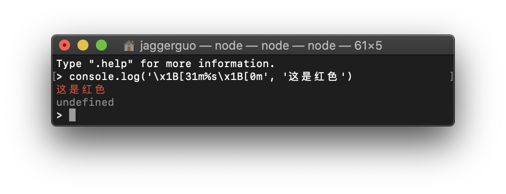
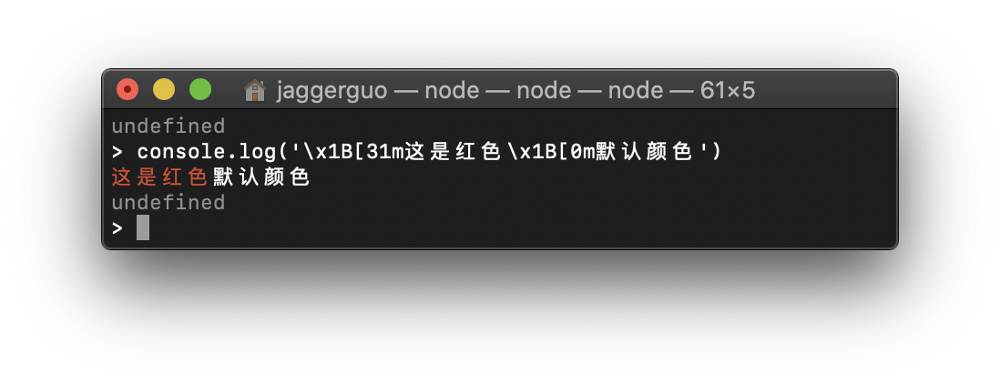
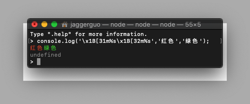

# NodeJS控制台彩色文字输出

> 我们都知道，在nodejs环境下使用普通的console.log,console.error,console.info输出都是不会有颜色的，如果你不知道（其实我也是最近在基于NodeJS来开发工具,打打印错误信息时发现的😂），那你现在知道啦😏。那么问题来了，在这种情况下，如果我们需要彩色输出，又不想引入除NodeJS自带的其他库来实现该功能，该怎么办呢？请看下面:

### 输出规则

1. 语法如下实例：

```shell
console.log('\x1B[31m%s\x1B[0m', '这是红色')
```



2. 规则说明

```\x1B[31m```: 是一个转义序列，它将被您的终端拦截并指示它切换到红色。
```\x1B```:是不可打印控制字符 的代码escape。仅处理颜色和样式的转义序列也称为 ANSI转义码 并且是标准化的，因此它们（应该）可以在任何平台上工作。这里可以指定多种样式\x1B[31m\x1B[42m；
```%s ```: 是字符串（第二个参数）被注入的位置；上述代码还可以这样写：

```shell

console.log('\x1B[31m这是红色\x1B[0m')

```

```\x1B[0m```: 表示重置终端颜色，使其在此之后不再继续成为所选颜色,如下：
```shell
console.log('\x1B[31m这是红色\x1B[0m默认颜色')

```


### 颜色参考
1. 常用参数控制符（维基百科查询结果）：

|  代码   | 作用  | 背景色代码 |
| :----:  | :----:| :----: |
| 38  | 设置前景色 | 下一个参数是5;n或2;r;g;b，见下。
|39  | 		默认前景色 |		由具体实现定义（按照标准）。
| 40–47 | 设置背景色 | 	参见下面的颜色表。
| 48  | 设置背景色 |		下一个参数是5;n或2;r;g;b，见下。
| 49  | 默认背景色 | 由具体实现定义（按照标准）
| 90–97  | 		设置明亮的前景色|	aixterm（非标准）
| 100–107  | 设置明亮的背景色 | 	aixterm（非标准）


2. 常用颜色表：

|  名称   | 前景色代码  | 背景色代码 |
| :----:  | :----:| :----: |
| 黑  | 30 | 40
| 红  | 	31 |	41
| 绿  | 32 | 42
| 黄  | 	33 |	43
| 蓝  | 34 | 44
| 品红  | 	35 |	45
| 白  | 37 | 47
| 亮黑（灰）  | 	90 |	100
| 亮红  | 91 | 101
| 亮绿  | 	92 |	102
| 亮黄  | 93 | 103
| 亮蓝  | 	94 |	104
| 亮品红  | 95 | 105
| 亮青  | 	96|	106
| 亮白  | 97 | 107


3. 代码示例:
- 颜色：
```js
const colorStyle = {
    'bright'    : '\x1B[1m', // 亮色
    'grey'      : '\x1B[2m', // 灰色
    'italic'    : '\x1B[3m', // 斜体
    'underline' : '\x1B[4m', // 下划线
    'reverse'   : '\x1B[7m', // 反向
    'hidden'    : '\x1B[8m', // 隐藏
    'black'     : '\x1B[30m', // 黑色
    'red'       : '\x1B[31m', // 红色
    'green'     : '\x1B[32m', // 绿色
    'yellow'    : '\x1B[33m', // 黄色
    'blue'      : '\x1B[34m', // 蓝色
    'magenta'   : '\x1B[35m', // 品红
    'cyan'      : '\x1B[36m', // 青色
    'white'     : '\x1B[37m', // 白色
    'blackBG'   : '\x1B[40m', // 背景色为黑色
    'redBG'     : '\x1B[41m', // 背景色为红色
    'greenBG'   : '\x1B[42m', // 背景色为绿色
    'yellowBG'  : '\x1B[43m', // 背景色为黄色
    'blueBG'    : '\x1B[44m', // 背景色为蓝色
    'magentaBG' : '\x1B[45m', // 背景色为品红
    'cyanBG'    : '\x1B[46m', // 背景色为青色
    'whiteBG'   : '\x1B[47m' // 背景色为白色
}    
```
- 示例演示：
```js
console.log('\x1B[36;5;1;4m','测试一下'); //缓慢闪烁的青色加粗带下划线字体
```

<iframe name="music" src="./img/videoNode.gif"marginwidth="1px" marginheight="20px" width=100% height="80px" frameborder=1 　scrolling="yes">
</iframe>


```js
console.log('\x1B[31m%s\x1B[32m%s','红色','绿色'); //红色、绿色
```


好了，更多的效果，各位客官可以自己打印出来看看。
